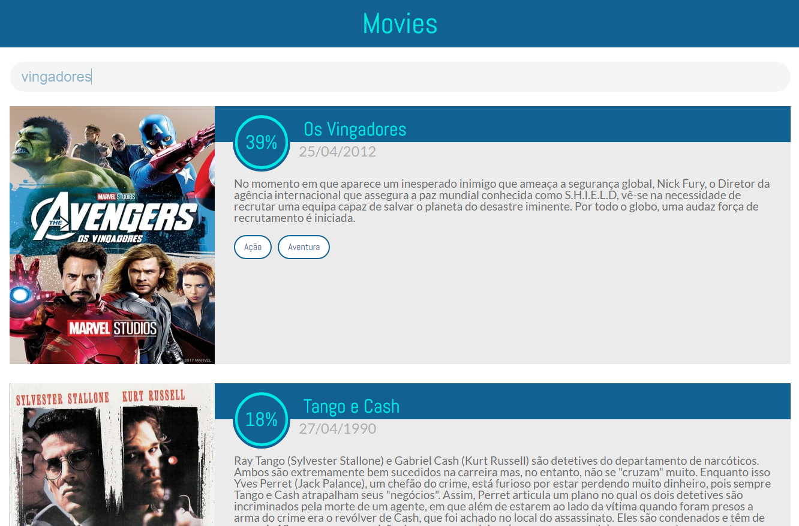
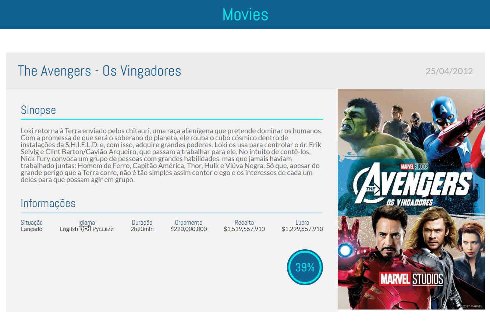

#[challenge-cubos](https://github.com/gabrieljony/challenge-cubos)

Challenge Cubos Front-End

### Author

**Gabriel Jony**

### Tech Stack

-   [javascript](https://developer.mozilla.org/pt-BR/docs/Aprender/JavaScript) ES6/2015
-   [react](https://pt-br.reactjs.org/) 16.11.0
-   [styled-components](https://www.styled-components.com/) 4.4.1
-   [axios](https://github.com/axios/axios) 0.19.0
-   [react-router-dom](https://github.com/ReactTraining/react-router) 5.1.2
-   [prop-types](https://github.com/facebook/prop-types) 15.7.2
-   [redux](https://redux.js.org/) 4.0.4
-   [react-redux](https://github.com/reduxjs/react-redux) 7.1.3
-   [redux-saga](https://github.com/redux-saga/redux-saga) 1.1.3
-   [API](https://www.themoviedb.org/?language=pt-BR)

## Installing / Getting started

Clone repository:

```shell
$ git clone https://github.com/gabrieljony/challenge-cubos.git
$ cd challenge-cubos/
```

Install dependencies:

```shell
$ yarn install
```

## Development environment - http://localhost:3000/

```shell
$ yarn start
```

## Template the Challenge





